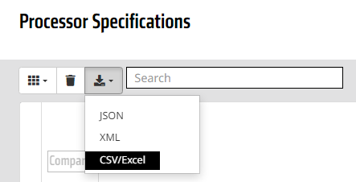

# CPU Specification Dataset

Dataset for CPU specifications from Intel and AMD.

## Table of Content

* [Raw Datasets](dataset)
* [Dataset API](dataset-api/src/main/java/cpu/spec/dataset/api)
* [Intel Web Scraper](intel-web-scraper/src/main/java/cpu/spec/scraper)
* [Benchmark Web Scraper](benchmark-web-scraper/src/main/java/cpu/spec/scraper)
* [Cpuworld Web Scraper](cpuworld-web-scraper/src/main/java/cpu/spec/scraper)

## Installation

Tested on __OpenJDK 17.0.2__ & __Maven 3.6.3__:

```shell
copy ./dataset/* ./dataset-api/src/main/resources/dataset/
mvn clean install -DskipTests
```

## Dataset API Usage

```shell
cd dataset-api
mvn spring-boot:run
```

Endpoint is available at: `GET http://localhost:8080/api/cpu-dataset`

<details>
  <summary>Configurations</summary>

[dataset-api/application.properties](dataset-api/src/main/resources)

| Property                                     | Example Value                         | Description                        |
|----------------------------------------------|---------------------------------------|------------------------------------|
| `spring.datasource.url`                      | `jdbc:mysql://localhost:3306/cpu_db`  | Full url to a MySQL database       |
| `spring.datasource.username`                 | `root`                                | Username and usually root          |
| `spring.datasource.password`                 | `password`                            | Custom password                    |
| `spring.jpa.hibernate.ddl-auto`              | `update` or `validate`                | Table schema update mode           |
| `spring.jpa.defer-datasource-initialization` | `false` or `true`                     | Defer database update with dataset |

</details>

## Container Image

```shell
docker run --name mysql -e MYSQL_ROOT_PASSWORD=password -e MYSQL_DATABASE=cpu_db -p 3306:3306 -d mysql:8
```

```shell
docker build -t ghcr.io/felixsteinke/cpu-spec-dataset-api:latest .
docker run -p 8080:80 --name dataset-api ghcr.io/felixsteinke/cpu-spec-dataset-api:latest
```

```shell
docker push ghcr.io/felixsteinke/cpu-spec-dataset-api:latest
```

### Container Configuration

| Environment Key              | Example Value                                   | Description                  |
|------------------------------|-------------------------------------------------|------------------------------|
| `SPRING_DATASOURCE_URL`      | `jdbc:mysql://host.docker.internal:3306/cpu_db` | Full url to a MySQL database |
| `SPRING_DATASOURCE_USERNAME` | `root`                                          | Username and usually root    |
| `SPRING_DATASOURCE_PASSWORD` | `password`                                      | Custom password              |

## Dataset Update

All updates to the dataset need to carefully reviewed. The column mappings and modifications need to be adjusted in the
corresponding [Dataset Class](dataset-api/src/main/java/cpu/spec/dataset/api/dataset) for the __Dataset API__.

### [Intel Dataset](dataset/intel-cpus.csv)

Extracted from
[https://ark.intel.com/content/www/us/en/ark.html](https://ark.intel.com/content/www/us/en/ark.html#@Processors)
with the responsible __Web Scraper__.

```shell
cd intel-web-scraper
java -jar ./target/exectuable.jar
```

### [AMD Dataset](dataset/amd-cpus.csv)

Manually __Export Data__ as __CSV/Excel__
from [https://www.amd.com/en/products/specifications/processors](https://www.amd.com/en/products/specifications/processors)

<details>
  <summary>Website Screenshot</summary>



</details>

### [CPU Benchmark Dataset](dataset/benchmark-cpus.csv)

Extracted from [https://www.cpubenchmark.net/cpu_list.php](https://www.cpubenchmark.net/cpu_list.php)
with the responsible __Web Scraper__.

```shell
cd benchmark-web-scraper
java -jar ./target/exectuable.jar
```

### [CPU World Dataset](dataset/cpuworld-cpus.csv)

Extracted from [https://www.cpu-world.com/CPUs/CPU.html](https://www.cpu-world.com/CPUs/CPU.html)
with the responsible __Web Scraper__.

```shell
cd cpuworld-web-scraper
mvn -jar ./target/exectuable.jar
```
